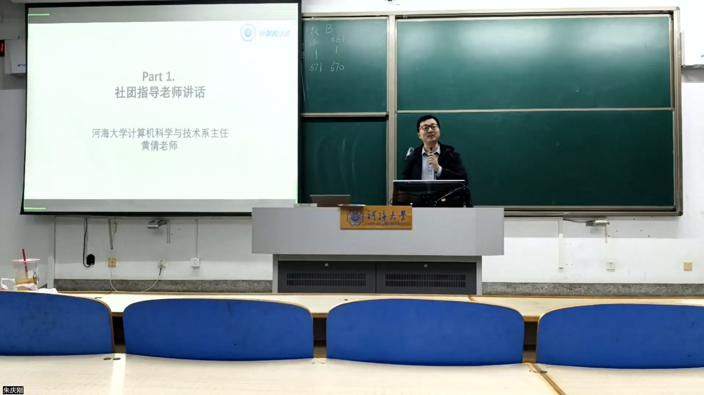
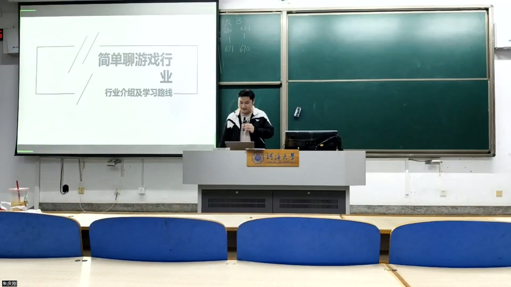
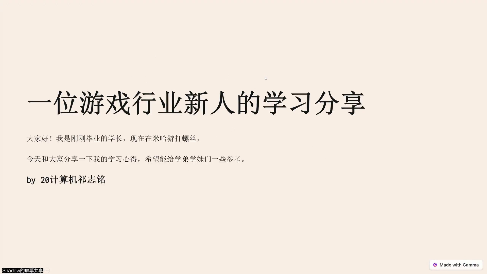
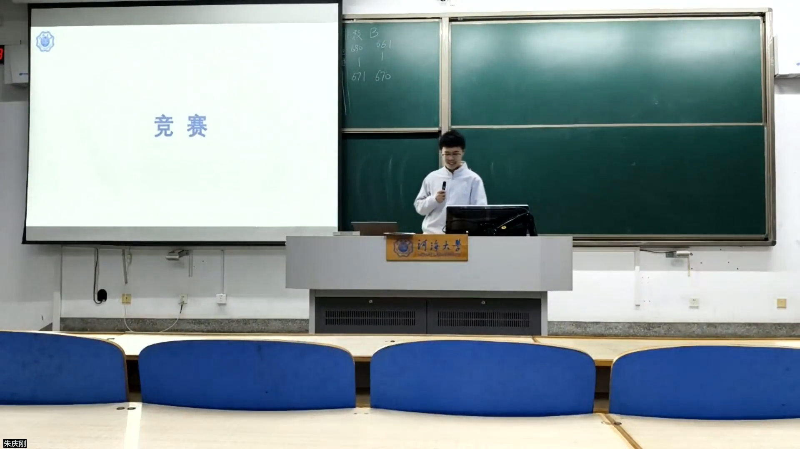
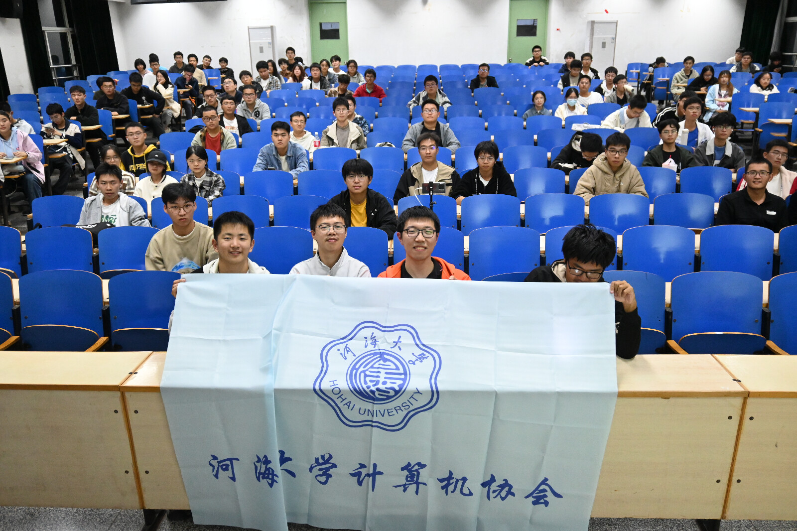

# 2024年度计算机协会见面会圆满完成
河海大学计算机协会在2024年11月9日晚顺利举办了新生见面会。本次见面会由现任社长朱庆刚与副社长钱子恒主持，特别感谢社团指导教师黄倩老师与特邀嘉宾彭咏秋、祁志铭同学参加了此次见面会，也感谢其他全体与会同学。

## 活动流程

首先，黄倩老师发表致辞，肯定了社团一年以来的工作成功，表达了对新同学的欢迎与祝福，也表达了对协会新一年发展的殷切期待。

接着，特邀嘉宾彭咏秋同学给大家介绍了游戏行业的相关内容。

然后，特邀嘉宾祁志铭学长为大家带来了关于技术美术的分享。

随后，社长朱庆刚与副社长钱子恒分享了一些包括新生学习路线与竞赛等大家关心的热点内容。

最后，全体与会人员进行合影留念。

## 活动总结
本次见面会为新生同学分享了游戏开发，热点话题，学习路线等内容。希望新生同学们在未来的大学生活中能够学有所长，做有所成。希望计算机协会能够在新的一年中取得更好的成绩。